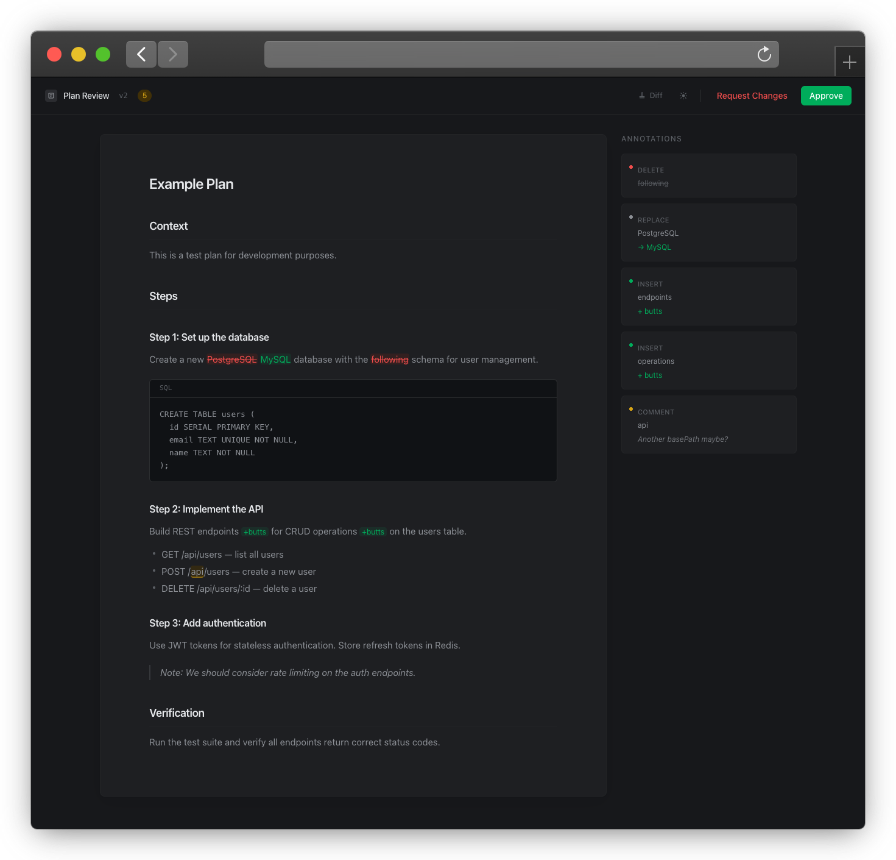

# open-plan-annotator

A fully local agentic coding plugin (claude-code, opencode) that intercepts plan mode, opens an annotation UI in your browser, and feeds structured feedback back to the agent.

Select text to strikethrough, replace, insert, or comment — then approve the plan or request changes.


> UI for annotating LLM Plans

## How it works

1. Claude calls `ExitPlanMode`
2. A `PermissionRequest` hook launches the `open-plan-annotator` binary
3. An ephemeral HTTP server starts and opens a React UI in your browser
4. You review and annotate the plan
5. **Approve** — Claude proceeds with the plan
6. **Request Changes** — annotations are serialized as structured feedback and Claude revises

The server shuts down after you decide. Everything runs locally, nothing leaves your machine.

## Install

```sh
bun install
bun run build
```

This produces a single compiled binary at `build/open-plan-annotator`. Add it to your `PATH`, then install the plugin in Claude Code:

```sh
claude plugin add /path/to/open-plan-annotator/plugin
```

## Annotations

| Type | Shortcut | Description |
|------|----------|-------------|
| Delete | `d` | Strikethrough selected text |
| Replace | `r` | Replace selected text with new text |
| Insert | `i` | Insert text after selection |
| Comment | `c` | Attach a comment to selected text |

Global shortcuts: `Cmd+Enter` to approve, `Cmd+Shift+Enter` to request changes.

## Development

```sh
bun run dev
```

Starts the Bun server on port 3847 with a test plan and the Vite dev server on port 5173 with HMR.

```sh
bun run lint        # check
bun run lint:fix    # auto-fix
bun run format      # format
```

## License

MIT
