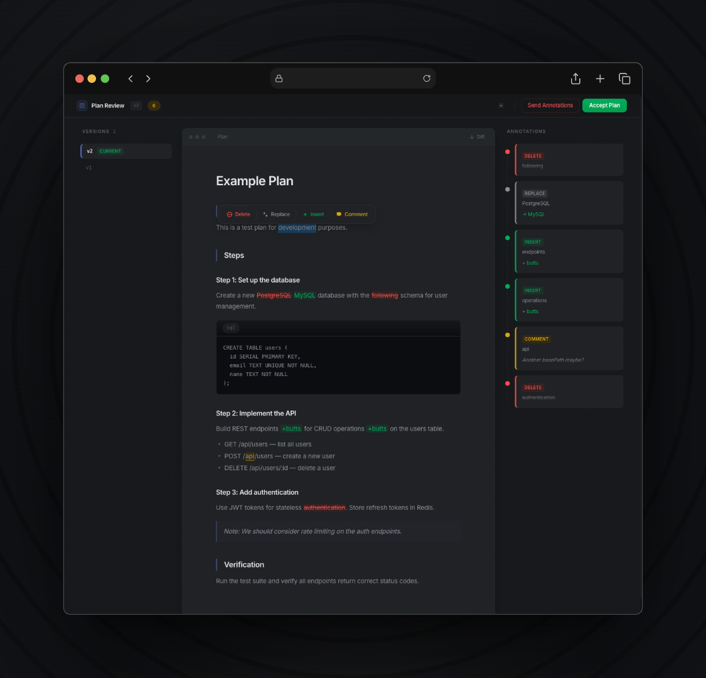

# open-plan-annotator

[](https://www.npmjs.com/package/open-plan-annotator)
[](https://opensource.org/licenses/MIT)
[]()

A fully local agentic coding plugin that intercepts plan mode and opens an annotation UI in your browser. Mark up the plan, send structured feedback to the agent, and receive a revised version — iterate as many times as you need until you're ready to accept.

Select text to <code style="color: purple">strikethrough</code>, <code style="color: orange">replace</code>, <code style="color: blue">insert</code>, or <code style="color: red">comment</code> — then approve the plan or request changes.





## How it works

1. Host submits a plan to `open-plan-annotator`
2. An ephemeral HTTP server starts and opens a React UI in your browser
3. You review and annotate the plan
4. **Approve** or **Request Changes**
5. The tool returns host-specific JSON output (Claude hook output or OpenCode plugin output)

The server shuts down after you decide. Everything runs locally, nothing leaves your machine.

## Install

**1. Install the binary**

```sh
npm install -g open-plan-annotator
```

This JS shim downloads the correct binary for your platform (macOS, Linux).

> [!NOTE]
> If using pnpm, postinstall scripts will be blocked by default. You can run the
> 'open-plan-annotator' manually to trigger a download, or the first invocation
> by Claude will also trigger the binary download.

### Claude Code

Add the marketplace and install the plugin:

From within Claude Code:

```
/plugin marketplace add ndom91/open-plan-annotator
/plugin install open-plan-annotator@ndom91-open-plan-annotator
```

This registers the `ExitPlanMode` hook that launches the annotation UI.


> [!NOTE]
> The first run might take a few seconds if you hadn't installed the binary, as
> Claude will trigger the download then.

### OpenCode

The OpenCode plugin uses the `@opencode-ai/plugin` SDK to register a `submit_plan` tool and inject system prompt instructions that tell the agent to use plan mode.

**Option A: Install from npm (recommended)**

```sh
npm install -g open-plan-annotator
cd /path/to/your/project
open-plan-annotator-install-opencode
```

This installs the plugin to `~/.config/opencode/plugins/open-plan-annotator/`, installs dependencies, and creates a loader shim that OpenCode auto-discovers — no config changes needed.

**Option B: From source**

```sh
git clone https://github.com/ndom91/open-plan-annotator.git
cd open-plan-annotator
bun install
bun run install:opencode-plugin   # installs to .opencode/plugins/ in CWD
```

The install script creates the auto-discovery shim, so no config changes needed.

The plugin automatically:
- Injects plan-mode instructions into the agent's system prompt
- Registers a `submit_plan` tool that the agent calls after creating a plan
- Spawns the annotation UI in your browser for review
- Returns structured feedback to the agent on approval or rejection

### From source (Claude Code)

```sh
git clone https://github.com/ndom91/open-plan-annotator.git
cd open-plan-annotator
bun install
bun run build
```

Then load it directly in Claude Code:

```sh
claude --plugin-dir ./open-plan-annotator
```

## Annotations

| Type | Shortcut | Description |
|------|----------|-------------|
| Delete | `d` | Strikethrough selected text |
| Replace | `r` | Replace selected text with new text |
| Insert | `i` | Insert text after selection |
| Comment | `c` | Attach a comment to selected text |

Global shortcuts: `Cmd+Enter` to approve, `Cmd+Shift+Enter` to request changes.

## Development

```sh
bun run dev
```

Starts the Bun server on port 3847 with a test plan and the Vite dev server on port 5173 with HMR.

```sh
bun run lint        # check
bun run lint:fix    # auto-fix
bun run format      # format
```

## License

MIT
