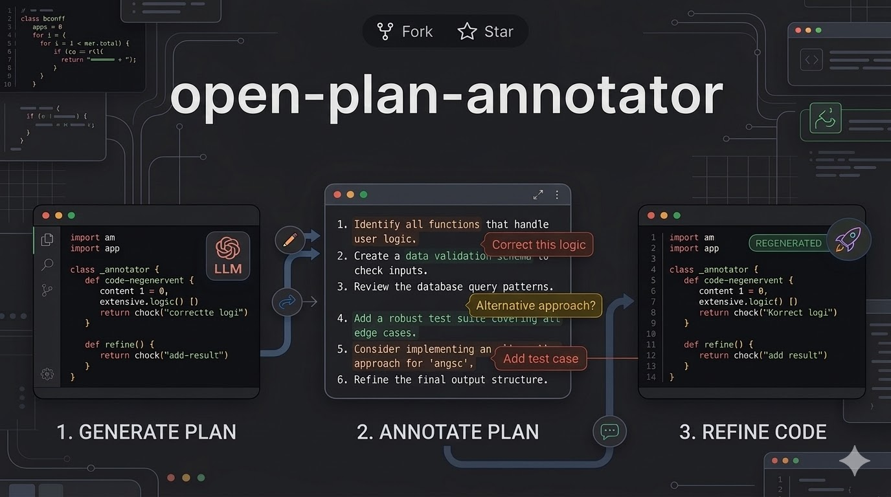
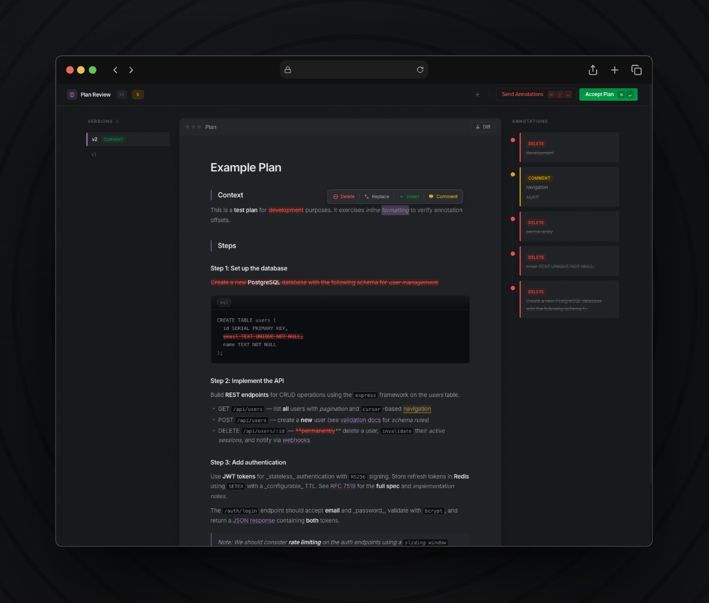

[](https://www.npmjs.com/package/open-plan-annotator)
[](https://opensource.org/licenses/MIT)
[]()

A fully local agentic coding plugin that intercepts plan mode and opens an annotation UI in your browser. Mark up the plan, send structured feedback to the agent, and receive a revised version — iterate as many times as you need until you're ready to approve.

Select text to <code>strikethrough</code>, <code>replace</code>, <code>insert</code>, or <code>comment</code> — then approve the plan or request changes


## How It Works

1. Your coding agent (Claude Code or OpenCode) finishes writing a plan
2. The plugin launches an ephemeral HTTP server and opens a React UI in your browser
3. You review the plan and annotate it — strikethrough, replace, insert, or comment on any section
4. **Approve** to let the agent proceed, or **Request Changes** to send your annotations back as structured feedback
5. The agent revises the plan and the cycle repeats until you're satisfied

Everything runs locally. Nothing leaves your machine.



## Install

> [!NOTE]
> `open-plan-annotator` now ships as one package-managed install. The npm package
> contains the plugin glue and resolves a platform runtime package locally. There
> is no first-run binary download and no in-app self-update path.

### Claude Code

From within Claude Code, add the marketplace and install the plugin:

```
/plugin marketplace add ndom91/open-plan-annotator
/plugin install open-plan-annotator@ndom91-open-plan-annotator
```

This installs the npm-backed plugin and registers the `ExitPlanMode` hook that launches the annotation UI. In Claude Code, third-party marketplaces have auto-update disabled by default, so also enable auto-update for the `ndom91-open-plan-annotator` marketplace in the Marketplace UI.

### OpenCode

Add `open-plan-annotator` to the `plugin` array in your OpenCode config (`opencode.json` or `.opencode/config.json`):

```json
{
  "plugin": ["open-plan-annotator@latest"]
}
```

OpenCode will install the package and load it automatically. The plugin:
- Injects plan-mode instructions into the agent's system prompt
- Registers a `submit_plan` tool that the agent calls after creating a plan
- Spawns the annotation UI in your browser for review
- Returns structured feedback to the agent on approval or rejection
- Optionally hands off to an implementation agent after approval

To update, refresh the plugin through OpenCode and restart the app so it reloads the latest package-managed runtime.

> [!NOTE]
> The update mechanism changed significantly in `1.0.20+`: OpenCode now loads the npm package plus a platform runtime package instead of using the old in-place binary updater. If OpenCode appears to be stuck on an older plugin build, clear the cached `open-plan-annotator` entries under `~/.cache/opencode/node_modules/` and restart OpenCode.

#### Implementation Handoff

By default, after a plan is approved the plugin sends "Proceed with implementation." to a `build` agent. To customize or disable this, create `open-plan-annotator.json` in your project's `.opencode/` directory or globally in `~/.config/opencode/`:

```json
{
  "implementationHandoff": {
    "enabled": true,
    "agent": "build"
  }
}
```

Set `enabled` to `false` to disable auto-handoff. Project config overrides global config.

### Manual Install

If you want to run the CLI standalone or install the package globally:

```sh
pnpm add -g open-plan-annotator
npm install -g open-plan-annotator
```

#### From Source

```sh
git clone https://github.com/ndom91/open-plan-annotator.git
cd open-plan-annotator
bun install
bun run build
```

Then load it directly in Claude Code:

```sh
claude --plugin-dir ./open-plan-annotator
```

## Updates

- OpenCode: update the installed npm plugin through OpenCode, then restart OpenCode.
- Claude Code: update the marketplace/plugin install, then restart Claude Code.
- Standalone/global install: update the npm package (`npm`, `pnpm`, or `bun`), then rerun `open-plan-annotator`.

The built-in `doctor` command reports the resolved runtime package and runtime path:

```sh
open-plan-annotator doctor
```

## Keyboard Shortcuts

| Action | Shortcut | Description |
|--------|----------|-------------|
| Delete | `d` | Strikethrough selected text |
| Replace | `r` | Replace selected text with new content |
| Insert | `i` | Insert text after the selection |
| Comment | `c` | Attach a comment to selected text |
| Approve | `Cmd+Enter` | Approve the plan and proceed |
| Request Changes | `Cmd+Shift+Enter` | Send annotations back to the agent |

## Development

```sh
bun run dev
```

Starts the Bun server on port 3847 with a test plan and the Vite dev server on port 5173 with HMR.

```sh
bun run lint        # check
bun run lint:fix    # auto-fix
bun run format      # format
```

## Maintainer Docs

- Architecture: [`docs/architecture.md`](docs/architecture.md)
- Operations: [`docs/operations.md`](docs/operations.md)
- Release process: [`docs/release.md`](docs/release.md)

## License

MIT
