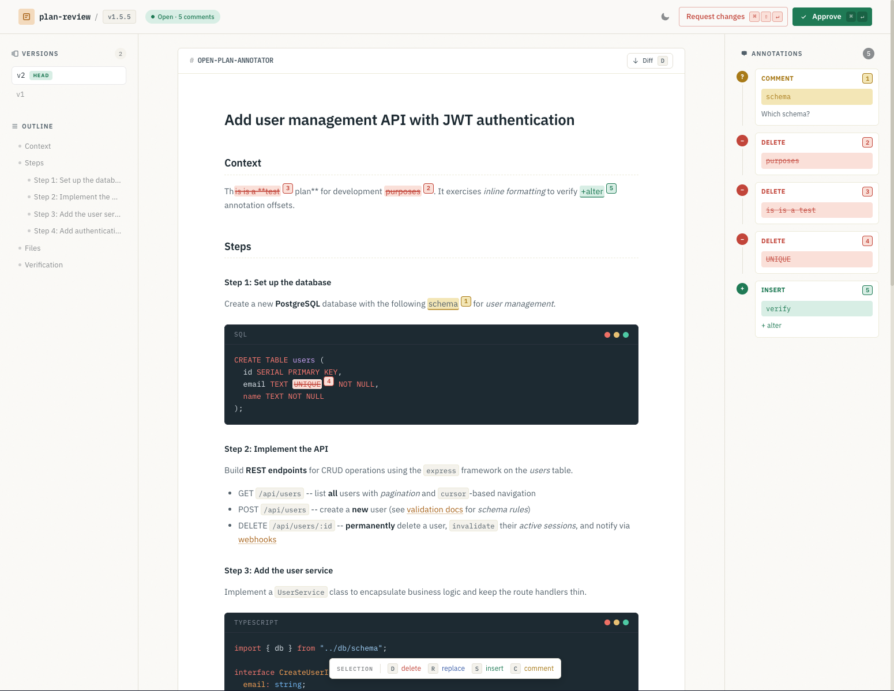

# open-plan-annotator

[](https://www.npmjs.com/package/open-plan-annotator)
[](https://opensource.org/licenses/MIT)
[]()

A fully local agentic coding plugin that intercepts plan mode and opens an annotation UI in your browser. Mark up the plan, send structured feedback to the agent, and receive a revised version — iterate as many times as you need until you're ready to approve.

Select text to <code>strikethrough</code>, <code>replace</code>, <code>insert</code>, or <code>comment</code> — then approve the plan or request changes


## How It Works

1. Your coding agent (Claude Code or OpenCode) finishes writing a plan
2. The plugin launches an ephemeral HTTP server and opens a React UI in your browser
3. You review the plan and annotate it — strikethrough, replace, insert, or comment on any section
4. **Approve** to let the agent proceed, or **Request Changes** to send your annotations back as structured feedback
5. The agent revises the plan and the cycle repeats until you're satisfied

Everything runs locally. Nothing leaves your machine.



## Install

`open-plan-annotator` is package-managed: the plugin package installs the local platform runtime it needs. There is no first-run binary download and no in-app updater.

### Claude Code

Install from inside Claude Code:

```
/plugin marketplace add ndom91/open-plan-annotator
/plugin install open-plan-annotator@ndom91-open-plan-annotator
```

What you get:

- `ExitPlanMode` hook: opens the annotation UI whenever Claude submits a plan
- `/annotate-plan [task description]`: asks Claude to draft a plan and send it to the UI
- `open-plan-annotator`: runtime command invoked by the hook

Third-party marketplace auto-update is disabled by default in Claude Code. Enable auto-update for the `ndom91-open-plan-annotator` marketplace in the Marketplace UI if you want updates automatically.

### OpenCode

Add the plugin to your OpenCode config (`opencode.json` or `.opencode/config.json`):

```json
{
  "plugin": ["open-plan-annotator@latest"]
}
```

What you get:

- `annotate_plan`: tool the agent calls after drafting a markdown plan
- `open-plan-annotator`: runtime command spawned by the plugin
- optional implementation-agent handoff after approval

Restart OpenCode after installing or updating so it reloads the package-managed runtime.

### Pi

Install the Pi extension:

```sh
pi install npm:@open-plan-annotator/pi-extension
```

What you get:

- `annotate_plan`: tool the agent calls after drafting a markdown plan
- `/annotate-plan [plan markdown]`: command for manually reviewing supplied text or the latest assistant message
- `open-plan-annotator`: runtime command used by the extension

Manual review examples:

```sh
/annotate-plan
/annotate-plan # Plan\n\n1. Do the thing
```

### Manual / CLI

Install globally if you want to run the CLI directly:

```sh
bun add -g open-plan-annotator
npm install -g open-plan-annotator
```

This adds the `open-plan-annotator` command. To verify the resolved runtime:

```sh
open-plan-annotator doctor
```

## Updates

- Claude Code: update the marketplace/plugin install, then restart Claude Code.
- OpenCode: update the installed npm plugin through OpenCode, then restart OpenCode.
- Pi: update the Pi extension, then restart Pi.
- Manual/global install: update the npm package, then rerun `open-plan-annotator`.

## Keyboard Shortcuts

| Action | Shortcut | Description |
|--------|----------|-------------|
| Delete | `d` | Strikethrough selected text |
| Replace | `r` | Replace selected text with new content |
| Insert | `s` | Insert text after the selection |
| Comment | `c` | Attach a comment to selected text |
| Approve | `Cmd+Enter` | Approve the plan and proceed |
| Request Changes | `Cmd+Shift+Enter` | Send annotations back to the agent |

## Development

```sh
bun run dev
```

Starts the Bun server on port 3847 with a test plan and the Vite dev server on port 5173 with HMR.

```sh
bun run lint        # check
bun run lint:fix    # auto-fix
bun run format      # format
```

## Maintainer Docs

- Architecture: [`docs/architecture.md`](docs/architecture.md)
- Operations: [`docs/operations.md`](docs/operations.md)
- Release process: [`docs/release.md`](docs/release.md)

## License

MIT
